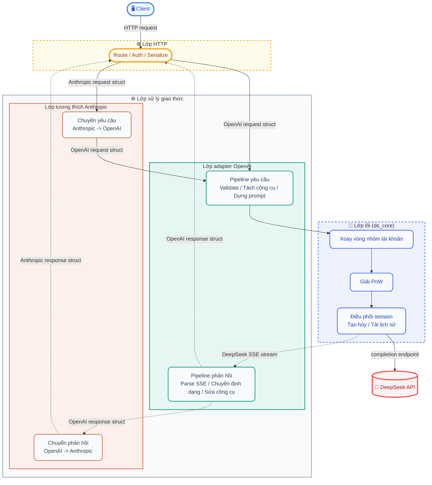
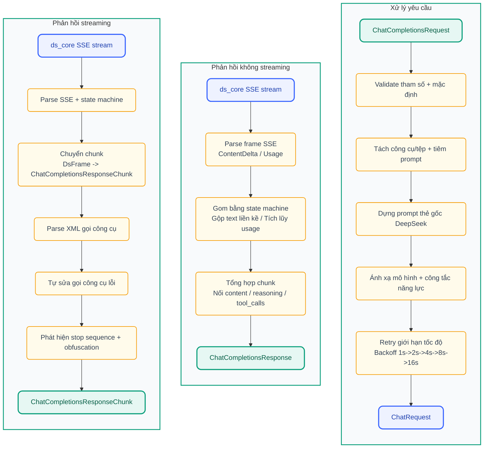
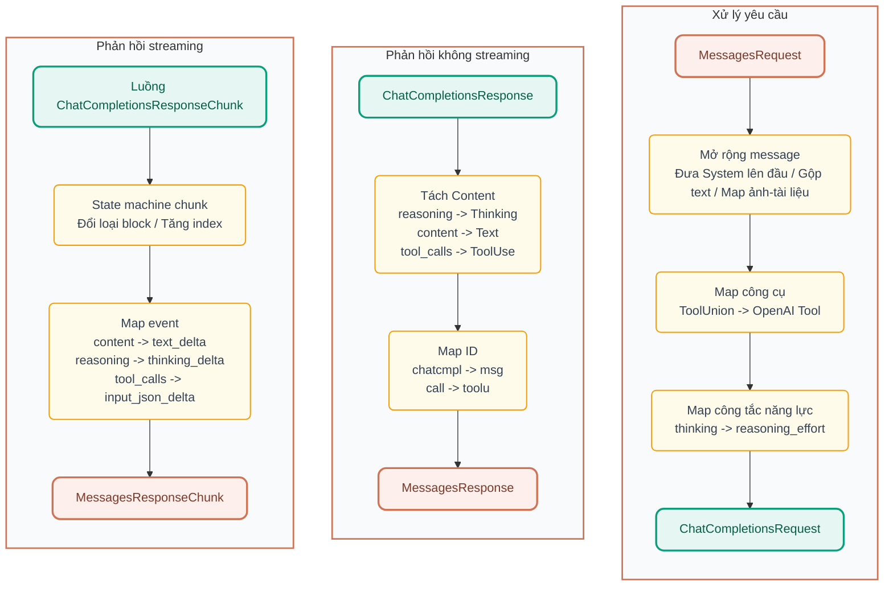

<p align="center">
  
</p>

<h1 align="center">DS-Free-API</h1>

<p align="center">
  <a href="LICENSE"></a>
  
  
  
</p>
<p align="center">
  
  
  
</p>

[English](README.en.md)

Reverse proxy cuộc trò chuyện miễn phí trên Web DeepSeek và chuyển đổi sang giao thức API tương thích OpenAI và Anthropic chuẩn. Hiện hỗ trợ `chat completions` và `messages`, gồm phản hồi streaming và gọi công cụ.

## Điểm nổi bật

- **Proxy API không tốn phí**: dùng giao diện Web miễn phí của DeepSeek, không cần API Key chính thức, vẫn có endpoint tương thích OpenAI / Anthropic.
- **Hỗ trợ hai giao thức**: tương thích OpenAI Chat Completions và Anthropic Messages API, dùng được với nhiều client phổ biến.
- **Sẵn sàng gọi công cụ**: triển khai OpenAI function calling, gồm parser công cụ và pipeline tự sửa 3 tầng (sửa text → sửa JSON → model sửa dự phòng), phủ hơn 10 định dạng lỗi.
- **Sẵn sàng tải tệp**: hỗ trợ tự tải lên DeepSeek session với OpenAI `file` / `image_url` content part và Anthropic `image` / `document` content block dạng data URL nội tuyến. HTTP URL tự bật chế độ tìm kiếm để model truy cập nội dung liên kết.
- **Bảng quản trị Web**: có giao diện xem trạng thái nhóm tài khoản, quản lý API Key, nhật ký yêu cầu, nạp nóng cấu hình.
- **Triển khai Rust**: một file thực thi + một TOML cấu hình, hiệu năng native đa nền tảng. Bảng Web được nhúng khi build.
- **Nhóm nhiều tài khoản**: xoay vòng ưu tiên tài khoản rảnh lâu nhất (DashMap đọc không khóa), hỗ trợ mở rộng song song.

## Bắt đầu nhanh

### Chạy bằng binary

1. Tải gói đúng nền tảng từ [releases](https://github.com/NIyueeE/ds-free-api/releases) rồi giải nén.
2. Sao chép `config.example.toml` thành `config.toml` và điền tài khoản. Có thể bỏ qua bước này rồi thêm tài khoản trong bảng quản trị sau khi chạy.
3. Chạy `./ds-free-api`.
4. Mở `http://127.0.0.1:22217/admin`, đặt mật khẩu quản trị, sau đó tạo API Key và quản lý tài khoản trong bảng điều khiển.

```bash
./ds-free-api
./ds-free-api -c /path/to/config.toml
RUST_LOG=debug ./ds-free-api
```

> **Song song**: API miễn phí có giới hạn tốc độ theo session. Dự án có phát hiện giới hạn + retry backoff hàm mũ để giữ ổn định.
> Số luồng khuyến nghị = số tài khoản / 2. Có thể khởi động không cần `config.toml`, rồi thêm tài khoản trong bảng quản trị.

### Chạy bằng Docker

```bash
docker compose -f docker-compose.yaml up -d
```

Tham khảo [file compose ví dụ](./docker/docker-compose.yaml).

Bảng quản trị ở `http://localhost:22217/admin`, lần đầu truy cập sẽ đặt mật khẩu quản trị.
Thư mục `config/` và `data/` được bind mount vào container, thay đổi cấu hình sẽ tự lưu bền về máy host.

### Tài khoản thử miễn phí

~~Các tài khoản dưới đây từng dùng chung mật khẩu `test12345`:~~

```text
Không ổn định, phần này không còn cung cấp. Hãy tự đăng ký.
```

> Có thể tham khảo cách trong [issue #62](https://github.com/NIyueeE/ds-free-api/issues/62).

## Endpoint API

| Phương thức | Đường dẫn | Mô tả |
|------|------|------|
| GET  | `/`   | Chuyển hướng sang bảng quản trị |
| GET  | `/health` | Kiểm tra sức khỏe |
| POST | `/v1/chat/completions` | Chat completions, hỗ trợ streaming và gọi công cụ |
| GET  | `/v1/models` | Danh sách mô hình |
| GET  | `/v1/models/{id}` | Chi tiết mô hình |
| POST | `/anthropic/v1/messages` | Anthropic Messages, hỗ trợ streaming và gọi công cụ |
| GET  | `/anthropic/v1/models` | Danh sách mô hình theo định dạng Anthropic |
| GET  | `/anthropic/v1/models/{id}` | Chi tiết mô hình theo định dạng Anthropic |

Bảng quản trị nằm tại `/admin`, lần đầu truy cập sẽ hướng dẫn đặt mật khẩu quản trị.

## Ánh xạ mô hình

`model_types` trong `config.toml` (mặc định `["default", "expert"]`) được tự ánh xạ:

| OpenAI model ID | Loại DeepSeek |
| ------------------ | ------------- |
| `deepseek-default` | Chế độ nhanh |
| `deepseek-expert`  | Chế độ chuyên gia |

Bí danh tùy chọn dùng `model_aliases`, căn theo index với `model_types`. Mặc định không có bí danh. Chuỗi rỗng bị bỏ qua:

```toml
# model_aliases = ["", "deepseek-v4-pro"]  -> deepseek-v4-pro ánh xạ tới expert (index 1)
model_aliases = []
```

Lớp tương thích Anthropic dùng cùng model ID qua `/anthropic/v1/messages`.

### Công tắc năng lực

- **Suy luận sâu**: bật mặc định. Để tắt rõ ràng, thêm `"reasoning_effort": "none"` vào body yêu cầu.
- **Tìm kiếm thông minh**: bật mặc định. DeepSeek backend sẽ tiêm prompt hệ thống mạnh hơn khi ở chế độ tìm kiếm, giúp model tuân thủ gọi công cụ tốt hơn. Để tắt rõ ràng, thêm `"web_search_options": {"search_context_size": "none"}` vào body.
- **Tải tệp**: hỗ trợ tệp nội tuyến (data URL) tự tải lên DeepSeek session và HTTP URL tự bật chế độ tìm kiếm:

  **OpenAI:**
  ```json
  {"type": "file", "file": {"file_data": "data:text/plain;base64,...", "filename": "doc.txt"}}
  {"type": "image_url", "image_url": {"url": "data:image/png;base64,..."}}
  {"type": "image_url", "image_url": {"url": "https://example.com/img.jpg"}}
  ```

  **Anthropic:**
  ```json
  {"type": "image", "source": {"type": "base64", "media_type": "image/png", "data": "..."}}
  {"type": "document", "source": {"type": "base64", "media_type": "text/plain", "data": "..."}}
  {"type": "image", "source": {"type": "url", "url": "https://example.com/img.jpg"}}
  ```

### Ảo giác thẻ gọi công cụ

Khớp mờ tích hợp (`｜`<=>`|`, `▁`<=>`_`) tự phủ đa số biến thể. Nếu model sinh thẻ dự phòng có định dạng khác, có thể thêm trong bảng điều khiển hoặc thêm dưới `[deepseek]` trong `config.toml`:

```toml
tool_call.extra_starts = ["<|tool_call_begin|>", "<tool_calls>", "<tool_call>"]
tool_call.extra_ends = ["<|tool_call_end|>", "</tool_calls>", "</tool_call>"]
```

## Bảng quản trị Web

Sau khi chạy dịch vụ, mở `http://127.0.0.1:22217/admin` để vào bảng quản trị:

- **Tổng quan**: thống kê yêu cầu và trạng thái nhóm tài khoản.
- **Nhóm tài khoản**: xem/thêm/xóa tài khoản, đăng nhập lại thủ công tài khoản đang ở trạng thái Error.
- **API Keys**: tạo/xóa API Key, hiển thị đã che bớt.
- **Mô hình**: danh sách và chi tiết mô hình khả dụng.
- **Cấu hình**: cấu hình đang chạy, đã che dữ liệu nhạy cảm.
- **Nhật ký**: nhật ký yêu cầu gần đây và nhật ký runtime.

<p align="center">
  
  <br>
  <em>Tổng quan bảng quản trị (Dashboard)</em>
</p>

<p align="center">
  
  <br>
  <em>Màn hình cấu hình (Config)</em>
</p>

Lần đầu truy cập sẽ đặt mật khẩu quản trị (lưu bằng bcrypt hash). Sau khi đăng nhập, hệ thống cấp JWT hiệu lực 24 giờ và thu hồi token cũ khi đổi mật khẩu.

## Biến môi trường

| Biến | Mặc định | Mô tả |
|------|--------|------|
| `RUST_LOG` | `info` | Mức log (`trace` / `debug` / `info` / `warn` / `error`) |
| `DS_DATA_DIR` | `.` (thư mục hiện tại) | Thư mục dữ liệu, chứa `logs/runtime.log` và `stats.json` |
| `DS_CONFIG_PATH` | `./config.toml` | Đường dẫn tệp cấu hình, ưu tiên thấp hơn tham số `-c` |

## Bảo mật

- **Bảng quản trị**: JWT auth + bcrypt password hash + giới hạn đăng nhập sai (5 lần sai khóa 5 phút).
- **Truy cập API**: xác thực bằng API Key tạo trong bảng quản trị (HashSet O(1)).
- **CORS**: cấu hình được danh sách Origin cho phép, mặc định chỉ `http://localhost:22217`.
- **Dữ liệu nhạy cảm**: ID tài khoản trong response header được che bớt, body yêu cầu không ghi log, file lưu bền đặt quyền 0600.

## Phát triển

### Triết lý thiết kế

**Một `config.toml` phản ánh toàn bộ trạng thái chạy**. Thay đổi từ bảng quản trị được ghi ngay vào `config.toml` và nạp nóng vào dịch vụ đang chạy.

**Không thêm phụ thuộc runtime hệ thống nếu không cần**. Dự án ưu tiên Rust thuần hoặc phụ thuộc liên kết tĩnh (như `wreq` + BoringSSL) để artifact build là một binary duy nhất, không cần `.so`/`.dll` ngoài.

### Sơ đồ kiến trúc ngắn gọn



### Pipeline dữ liệu

#### Pipeline OpenAI (`chat_completions`)



#### Pipeline Anthropic (`messages`)



Hướng dẫn phát triển chi tiết (build, test, Docker deploy, e2e test, v.v.) xem [docs/development.md](./docs/development.md).

## Giấy phép

[GNU General Public License v3.0](LICENSE)

[DeepSeek API chính thức](https://platform.deepseek.com/top_up) rất rẻ. Hãy ủng hộ dịch vụ chính thức khi có thể.

Mục đích ban đầu của dự án là trải nghiệm các model mới đang được thử nghiệm trên Web chính thức.

**Nghiêm cấm thương mại hóa**, tránh gây áp lực lên server chính thức. Mọi rủi ro tự chịu.
